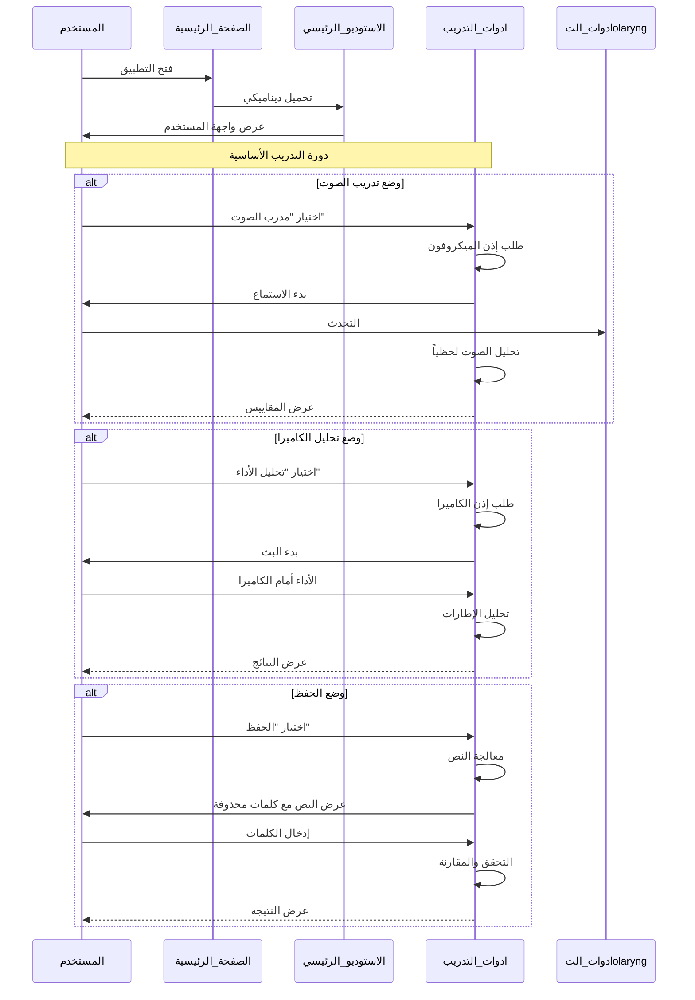
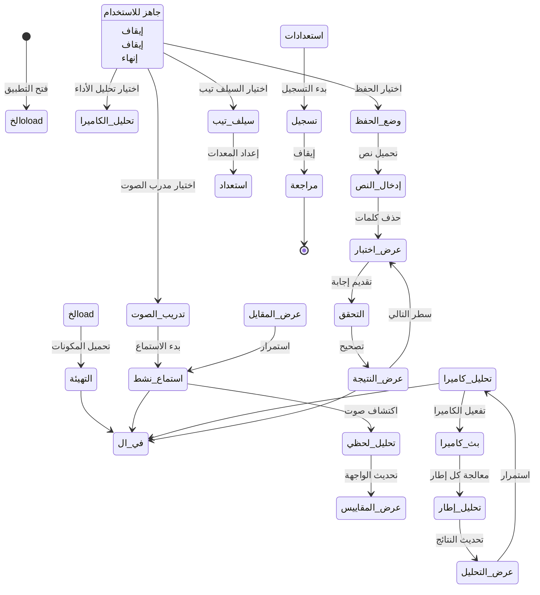
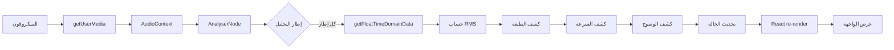
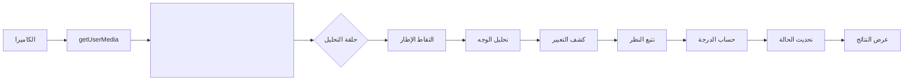

# آلية العمل الأساسية

## ١. ملخص تنفيذي

**ActorAI Arabic** هو استوديو ذكي لتمارين التمثيل والتدريب الفني للممثلين العرب. يعتمد التطبيق على تقنيات تحليل الصوت والفيديو وتقديم الملاحظات الفورية عبر واجهات برمجية متقدمة.

يوفر التطبيق أربع أدوات رئيسية:
1. **مدرب الصوت**: تحليل لحظي للصوت والنطق
2. **محلل الكاميرا**: تحليل الأداء البصري والتعبيرات
3. **أداة الحفظ**: نظام حفظ ذكي بالنصوص العربية
4. **جناح السيلف تيب**: أدوات تسجيل احترافية

---

## ٢. مسار التنفيذ الرئيسي

### التدفق العام للتطبيق



---

## ٣. دورة حياة البيانات

### حالة التطبيق



---

## ٤. الطبقات المعمارية

### جدول الطبقات

| الطبقة | المسؤولية | الملفات | المدخلات | المخرجات | معايير الجودة |
|--------|-----------|---------|----------|----------|---------------|
| **العرض** | واجهة المستخدم | `page.tsx`, `VoiceCoach.tsx`, `SelfTapeSuite.tsx` | أحداث المستخدم | React Components | تفاعل < 100ms |
| **الحالة** | إدارة الحالة | `hooks/*.ts` | أحداث، بيانات | حالة React | تحديث < 50ms |
| **التحليل** | معالجة البيانات | `useVoiceAnalytics.ts`, `useWebcamAnalysis.ts` | بيانات_media | مقاييس | دقة > 90% |
| **الأجهزة** | الوصول للعتاد | Web Audio API, MediaDevices API | طلبات API | streams | توافق 100% |

---

## ٥. القرارات المعمارية

### القرار ١: تحميل ديناميكي للمكون الرئيسي

**السبب**: تحسين وقت التحميل الأولي للصفحة

```typescript
const ActorAiArabicStudio = dynamic(
  () => import("@the-copy/actorai").then((mod) => ({
    default: mod.ActorAiArabicStudio,
  })),
  { ssr: false, loading: () => <Spinner /> }
);
```

**البدائل المدروسة**:
- استيراد ثابت: يحظر التحميل
- React.lazy: لا يدعم الواردات النمطية
- Server Components: غير مناسب للتفاعل

**التبعات**: تحسين UX مع تأخير طفيف في التحميل

---

### القرار ٢: استخدام React Hooks مخصصة

**السبب**: فصل منطق الأعمال عن واجهة المستخدم

```
hooks/
├── useVoiceAnalytics.ts    # 437 سطر
├── useWebcamAnalysis.ts    # 334 سطر  
├── useMemorization.ts      # 429 سطر
└── useNotification.ts      # 121 سطر
```

**البدائل المدروسة**:
- Redux: معقد overkill
- Context API: مناسب للحالة العامة فقط
- Class Components: قديم

**التبعات**: كود قابل لإعادة الاستخدام والصيانة

---

### القرار ٣: استخدام Web Audio API للتحليل

**السبب**: أداء عالي وتحكم كامل

```typescript
const audioContext = new AudioContext();
const analyser = audioContext.createAnalyser();
analyser.fftSize = 2048;
source.connect(analyser);
```

**البدائل المدروسة**:
- Web Speech API: محدود الدقة
- مكتبات خارجية: زيادة الحجم
- سيرفر: تأخير latency

**التبعات**: تحليل لحظي بدقة عالية

---

## ٦. تدفق البيانات التفصيلي

### تحليل الصوت



### تحليل الكاميرا



---

## ٧. إدارة الحالة

### حالة React في التطبيق

```typescript
interface AppState {
  // المستخدم
  user: User | null;
  
  // العرض الحالي
  currentView: ViewType;
  
  // الإشعارات
  notification: Notification | null;
  
  // التحليل
  analyzing: boolean;
  analysisResult: AnalysisResult | null;
}
```

### تدفق التحديث

```mermaid
sequenceDiagram
    participant المستخدم as المستخدم
    participant المكون as المكون
    participants Hook as Hook
    participants API as APIs
    
    المستخدم->>المكون: حدث (click, input)
    المكون->>Hook: استدعاء دالة
    Hook->>API: طلب API/جهاز
    API-->>Hook: بيانات
    Hook->>Hook: تحديث الحالة
    Hook-->>المكون: إعادة تصيير
    المكون-->>المستخدم: واجهة محدثة
```

---

## ٨. معالجة الأخطاء

### نموذج الأخطاء

```typescript
type ErrorType = 
  | 'PERMISSION_DENIED'
  | 'DEVICE_NOT_FOUND'
  | 'ANALYSIS_ERROR'
  | 'VALIDATION_ERROR';

interface AppError {
  type: ErrorType;
  message: string;
  details?: unknown;
}
```

### معالجة أخطاء الأجهزة

```typescript
// مثال: معالجة خطأ الكاميرا
try {
  const stream = await navigator.mediaDevices.getUserMedia({ 
    video: true 
  });
} catch (error) {
  if (error.name === 'NotAllowedError') {
    showError('لم يتم السماح بالوصول للكاميرا');
  } else if (error.name === 'NotFoundError') {
    showError('لم يتم العثور على كاميرا');
  }
}
```

---

## ٩. الأداء والتحسين

### استراتيجيات التحسين

| الاستراتيجية | التطبيق | التأثير |
|--------------|---------|--------|
| التحميل الديناميكي | `dynamic()` | تقليل وقت التحميل الأولي |
| طلبAnimationFrame | تحليل الصوت | smoother 60fps |
| State batching | React | تقليل إعادة التصيير |
| useCallback | المعالجات |稳定的 مراجع |

### benchmarks

- وقت التحميل الأولي: < 3 ثوانٍ
- استجابة التفاعل: < 100ms
- تحديث التحليل: 60fps
- استخدام الذاكرة: < 150MB
