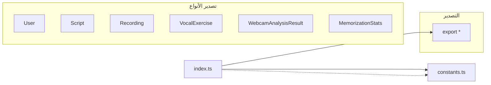
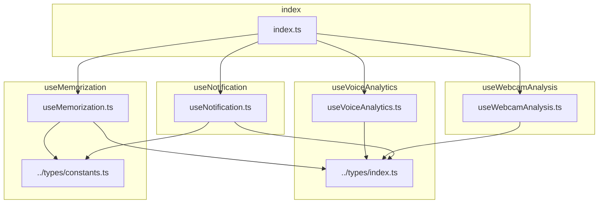
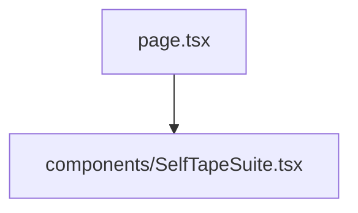
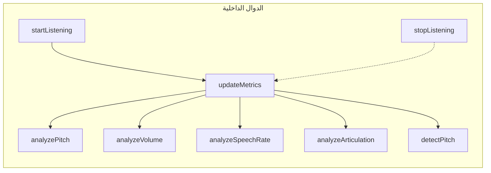
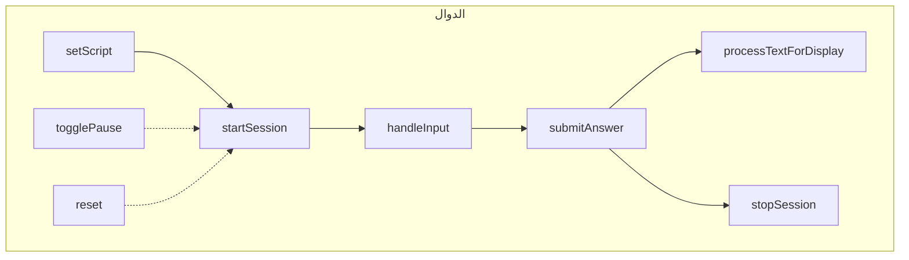
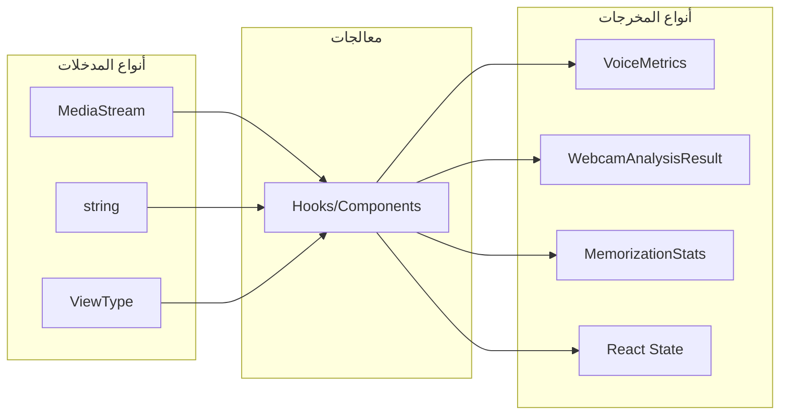

# العلاقات بين الملفات

## ١. نظرة عامة على التبعيات

### مخطط التبعيات العام

```mermaid
graph TD
    subgraph "الطبقة الرئيسية"
        page[page.tsx]
    end
    
    subgraph "مكتبة خارجية"
        lib[@the-copy/actorai]
    end
    
    subgraph "components/"
        studio[ActorAiArabicStudio]
        voice[VoiceCoach]
        selfTape[SelfTapeSuite]
    end
    
    subgraph "hooks/"
        voiceAna[useVoiceAnalytics]
        webcamAna[useWebcamAnalysis]
        memorization[useMemorization]
        notification[useNotification]
    end
    
    subgraph "types/"
        typesIdx[index.ts]
        constants[constants.ts]
    end
    
    page --> lib
    lib --> studio
    
    studio --> voice
    studio --> selfTape
    
    voice --> voiceAna
    voiceAna --> typesIdx
    
    selfTape --> webcamAna
    selfTape --> memorization
    webcamAna --> typesIdx
    memorization --> typesIdx
    memorization --> constants
    
    notification --> typesIdx
```

---

## ٢. تبعيات المجلدات

### types/



**الملفات**:
- `index.ts`: 612 سطر - أنواع TypeScript
- `constants.ts`: 312 سطر - ثوابت وبيانات

**التبعيات الخارجية**: `zod`

---

### hooks/



**الملفات**:
- `useVoiceAnalytics.ts`: 437 سطر - تحليل الصوت
- `useWebcamAnalysis.ts`: 334 سطر - تحليل الكاميرا
- `useMemorization.ts`: 429 سطر - أدوات الحفظ
- `useNotification.ts`: 121 سطر - الإشعارات
- `index.ts`: 29 سطر - التصدير

**التبعيات الداخلية**: `types/`, `constants.ts`

---

### components/

```mermaid
graph TD
    subgraph "VoiceCoach"
        VC[VoiceCoach.tsx] --> hooks[../hooks/useVoiceAnalytics]
    end
    
    subgraph "ActorAiArabicStudio"
        AS[ActorAiArabicStudio.tsx] --> external[@the-copy/actorai]
    end
```

**الملفات**:
- `VoiceCoach.tsx`: 650 سطر - مكون مدرب الصوت
- `ActorAiArabicStudio.tsx`: محمل من مكتبة خارجية

**التبعيات**: `hooks/useVoiceAnalytics`

---

### self-tape-suite/



**الملفات**:
- `page.tsx`: صفحة جناح السيلف تيب
- `SelfTapeSuite.tsx`: مكون السيلف تيب

---

## ٣. العلاقات الداخلية للدوال

### useVoiceAnalytics



**التبعيات**:
- `navigator.mediaDevices.getUserMedia`
- `AudioContext`, `AnalyserNode`
- `requestAnimationFrame`

---

### useMemorization



**التبعيات**:
- `setTimeout` - مؤقت التردد
- `localStorage` (اختياري)

---

## ٤. علاقات الاستيراد

### استيرادات page.tsx

```typescript
import dynamic from "next/dynamic";

const ActorAiArabicStudio = dynamic(
  () => import("@the-copy/actorai").then((mod) => ({
    default: mod.ActorAiArabicStudio,
  })),
  { ssr: false, loading: LoadingComponent }
);
```

### استيرادات VoiceCoach.tsx

```typescript
// مكونات UI
import { Button } from "@/components/ui/button";
import { Card } from "@/components/ui/card";
import { Alert } from "@/components/ui/alert";
import { Badge } from "@/components/ui/badge";
import { Progress } from "@/components/ui/progress";

// hooks
import { useVoiceAnalytics } from "../hooks/useVoiceAnalytics";
```

### استيرادات useVoiceAnalytics.ts

```typescript
import { useState, useCallback, useRef, useEffect } from "react";
// لا توجد استيرادات داخلية - يعمل بشكل مستقل
```

### استيرادات useMemorization.ts

```typescript
import { useState, useCallback, useRef } from "react";
import type { MemorizationStats } from "../types";
import { VALIDATION_CONSTANTS, SAMPLE_MEMORIZATION_SCRIPT } from "../types/constants";
```

---

## ٥. علاقات النوع

### أنواع المدخلات والمخرجات



---

## ٦. تبعيات npm

### التبعيات الرئيسية

```json
{
  "dependencies": {
    "@the-copy/actorai": "*",
    "react": "^18.2.0",
    "next": ">=14.0.0",
    "zod": "^3.22.0"
  },
  "devDependencies": {
    "@types/node": "^20.0.0",
    "typescript": "^5.0.0"
  }
}
```

---

## ٧. عدم وجود تبعيات دائرية

**التحقق**: تم تحليل التبعيات وليس هناك تبعيات دائرية.

```
✓ page.tsx → @the-copy/actorai
✓ components/* → hooks/*
✓ hooks/* → types/*
✓ types/constants.ts → types/index.ts (import type فقط)
```

---

## ٨. خريطة العلاقات الشاملة

```mermaid
graph TD
    subgraph "point"
        entry[page.tsx]
    end
    
    entry --> dynamic[dynamic import]
    dynamic --> library[@the-copy/actorai]
    
    library --> components[Components]
    
    components --> voice[VoiceCoach]
    components --> selfTape[SelfTapeSuite]
    
    voice --> hooks[Hooks]
    
    hooks --> voiceAnalytics[useVoiceAnalytics]
    hooks --> webcamAnalytics[useWebcamAnalysis]
    hooks --> memorization[useMemorization]
    hooks --> notification[useNotification]
    
    hooks --> types[Types]
    
    types --> index[index.ts]
    types --> constants[constants.ts]
    
    index --> zod[zod]
    constants --> index
```

---

## ٩. إرشادات الإضافة

### إضافة hook جديد

١. إنشاء ملف `useNewHook.ts` في `hooks/`
٢. استيراد الأنواع من `../types/index.ts`
٣. استيراد الثوابت من `../types/constants.ts` (إذا لزم)
٤. تصدير الدالة والواجهة من `hooks/index.ts`

```typescript
// hooks/useNewHook.ts
import { useState } from "react";
import type { SomeType } from "../types";

export function useNewHook() {
  const [state, setState] = useState<SomeType>(/* initial */);
  return { state, setState };
}
```

### إضافة نوع جديد

١. إضافة النوع في `types/index.ts`
٢. إضافة الثوابت المتعلقة في `types/constants.ts` (إذا وجدت)
٣. تحديث التوثيق

---

## ١٠. ملخص العلاقات

| المسار | النوع | العلاقات |
|--------|------|----------|
| `page.tsx` | نقطة الدخول | يستورد من `@the-copy/actorai` |
| `hooks/*` | منطق العمل | يستورد من `types/*` |
| `components/*` | عرض | يستورد من `hooks/*` |
| `types/index.ts` | أنواع | يستورد من `zod` |
| `types/constants.ts` | ثوابت | يستورد من `types/index.ts` (أنواع فقط) |

**إجمالي التبعيات**: 4 مستويات
**تبعيات دائرية**: none
**ملفات معزولة**: none
