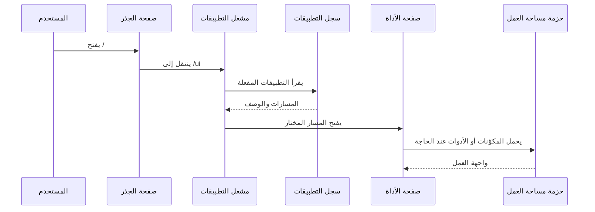
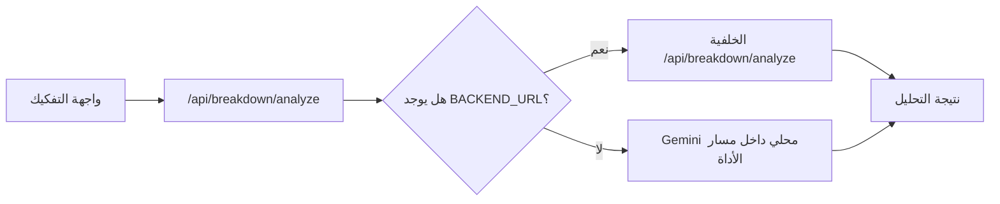

# ARCHITECTURE

## ماذا يفعل هذا المشروع؟

يوفّر المستودع منصة عربية موحّدة لإطلاق أدوات إنتاج وتحليل وكتابة سينمائية من نقطة دخول واحدة. تطبيق الويب يقدّم الهبوط، مشغّل التطبيقات، صفحات الأدوات، وواجهات برمجية محلية أو وسيطة. الخادوم الخلفي يتعامل مع المسارات المؤمّنة، المصادقة، التحليل متعدد المراحل، الطوابير، المراقبة، والوقت الحقيقي. أما الحزم داخل مساحة العمل فتفصل منطق الأدوات وعناصر الواجهة كي تُحمَّل أو تُستهلك من الويب بصورة مباشرة أو كسولة.

## Entry Points

| Mode | Entry file | Verified by |
|---|---|---|
| Web landing | `apps/web/src/app/page.tsx` | يعرض `HeroAnimation` |
| Web launcher | `apps/web/src/app/ui/page.tsx` | يقرأ `apps/web/src/config/apps.config.ts` |
| Main routed experience | `apps/web/src/app/(main)/layout.tsx` | يضيف الشريط الجانبي والتنقل |
| Web API | `apps/web/src/app/api/**/route.ts` | بنية `App Router` |
| Backend HTTP server | `apps/backend/src/server.ts` | يربط المسارات والأمان والطوابير |
| Backend MCP server | `apps/backend/src/mcp-server.ts` | يشغّل نقطة `/mcp` مستقلة |
| Workspace packages | `packages/*/src/index.ts` | خرائط `exports` داخل الحزم |

## Public Surface

| Type | Path | Notes |
|---|---|---|
| Web route registry | `apps/web/src/config/apps.config.ts` | المصدر المرجعي لقائمة التطبيقات المفعّلة ومساراتها |
| Web route | `apps/web/src/app/ui/page.tsx` | مشغّل الأدوات الشبكي |
| Web route | `apps/web/src/app/(main)/*/page.tsx` | صفحات الأدوات الفعلية |
| Endpoint | `apps/web/src/app/api/**/route.ts` | مسارات ويب برمجية محلية أو وسيطة |
| Endpoint | `apps/backend/src/server.ts` | واجهات الخلفية المؤمّنة وغير المؤمّنة |
| Export | `packages/shared/package.json` | يعرّف مسارات فرعية مثل `./ai` و `./db` و `./auth` |
| Export | `packages/ui/package.json` | يعرّف الجذر و `./components/*` |
| Export | `packages/*/package.json` | معظم حزم الأدوات تصدّر `.` و `./*` |

## Core Execution Paths

### Path 1: من الهبوط إلى تشغيل أداة

- Starts at: `apps/web/src/app/page.tsx`
- Main steps:
  1. يعرض مسار الجذر مكوّن الهبوط البصري `HeroAnimation`.
  2. يوجّه الهبوط المستخدم إلى المسار `ui/` عبر رابط صريح.
  3. يقرأ `apps/web/src/app/ui/page.tsx` قائمة التطبيقات المفعلة من `apps/web/src/config/apps.config.ts`.
  4. ينتقل المستخدم إلى صفحة الأداة المختارة وفق `path` المخزّن في السجل المركزي.
- Output: فتح صفحة أداة محددة أو صفحة الاستعراض الكاملة.
- Failure points:
  - سجل التطبيقات لا يطابق المسارات الموجودة.
  - مسار الأداة موجود لكنه لا يحمّل الصفحة أو الحزمة الفعلية.

### Path 2: تحميل صفحة أداة من حزمة مساحة عمل

- Starts at: `apps/web/src/app/(main)/directors-studio/page.tsx`
- Main steps:
  1. الصفحة تقرأ المشروع الحالي من `apps/web/src/lib/projectStore`.
  2. تستدعي خطافات محلية لجلب المشاهد والشخصيات.
  3. تحمّل عناصر العرض الثقيلة كسولًا من الحزمة `@the-copy/directors-studio`.
  4. تعرض محتوى المشروع أو حالة غياب المشروع أو حالة التحميل.
- Output: واجهة أداة معتمدة على حزمة مساحة العمل بدل وضع كل المنطق داخل صفحة الويب.
- Failure points:
  - غياب مشروع نشط.
  - فشل الاستدعاءات التي تغذي الخطافات.
  - عدم توافق عقود البيانات بين الصفحة والحزمة.

### Path 3: تحليل المحطات السبع عبر وسيط الويب إلى الخلفية

- Starts at: `apps/web/src/app/api/analysis/seven-stations/route.ts`
- Main steps:
  1. يستقبل الويب الطلب من الواجهة.
  2. يمرر الجسم كما هو إلى الخلفية عبر `NEXT_PUBLIC_API_URL`.
  3. تستقبل الخلفية الطلب في `apps/backend/src/server.ts`.
  4. ينفّذ `AnalysisController.runSevenStationsPipeline` التحليل إما تزامنيًا أو عبر الطابور.
- Output: تقرير التحليل أو معرّف مهمة في الطابور.
- Failure points:
  - عدم توفر عنوان الخلفية.
  - فشل المصادقة أو حماية `CSRF`.
  - فشل خدمة التحليل أو الطابور أو مزود الذكاء الاصطناعي.

### Path 4: تحليل السيناريو الهجين في أداة التفكيك

- Starts at: `apps/web/src/app/api/breakdown/analyze/route.ts`
- Main steps:
  1. يتحقق المسار من وجود نص سيناريو صالح.
  2. إذا كان `BACKEND_URL` مضبوطًا يمرر الطلب إلى الخلفية.
  3. إذا لم يوجد العنوان يستخدم خدمة محلية ضمن مسار الأداة عبر `breakdown/services/geminiService`.
  4. يعيد النتيجة إلى الواجهة بصيغة موحدة.
- Output: تحليل تفكيك مباشر حتى في غياب الخلفية الصريحة.
- Failure points:
  - غياب النص.
  - فشل استدعاء الخلفية.
  - غياب مفتاح `Gemini` عند التراجع إلى المسار المحلي.

## Sequence Diagram



## Flow Diagram



## Data Boundaries

| Boundary | Input | Output | Owner |
|---|---|---|---|
| UI -> Web Shell | أحداث المستخدم والتنقل | اختيار أداة أو إرسال طلب | `apps/web/src/app` |
| Web Shell -> Workspace Packages | خصائص العرض والبيانات المحلية | مكوّنات أداة أو وظائف مساعدة | `packages/*` |
| Web Route -> Backend | طلبات `HTTP` وملفات تعريف ارتباط وتوكنات | استجابة تحليل أو إدارة أو مراقبة | `apps/web/src/app/api` و `apps/backend/src/server.ts` |
| Backend -> Infrastructure | بيانات مصادقة وتحليل وطوابير | قاعدة بيانات أو `Redis` أو مزود ذكاء اصطناعي | `apps/backend/src/config` و `apps/backend/src/services` |
| Backend -> Realtime | أحداث مشروع أو حالة مهمة | بث `SSE` أو `WebSocket` | `apps/backend/src/services/sse.service.ts` و `websocket.service.ts` |

## Architecture Layers

| Layer | Responsibility | Main paths | Depends on | Used by |
|---|---|---|---|---|
| Presentation | الهبوط، مشغّل التطبيقات، صفحات الأدوات، الواجهة البصرية | `apps/web/src/app/page.tsx`, `apps/web/src/app/ui/page.tsx`, `apps/web/src/app/(main)` | `packages/ui`, حزم الأدوات, خطافات الويب | المستخدم النهائي |
| Integration | واجهات الويب البرمجية والصفحات التي تركّب حزم مساحة العمل | `apps/web/src/app/api`, صفحات مثل `directors-studio/page.tsx` | الخلفية، الحزم، البيئة | طبقة العرض |
| Application | وحدات التحكم والخدمات التي تنسق التحليل، المشاريع، المقاييس، والطوابير | `apps/backend/src/controllers`, `apps/backend/src/services`, `apps/backend/src/queues` | الوسطاء، التهيئة، البنية التحتية | الويب والعملاء الخلفيون |
| Shared domain | الأنواع المشتركة، الأدوات، عناصر الواجهة، منطق الأدوات القابل لإعادة الاستخدام | `packages/shared`, `packages/ui`, `packages/*` | حزم خارجية وإعدادات الحزمة | الويب وأحيانًا أدوات مستقلة |
| Infrastructure | البيئة، التتبّع، المراقبة، القاعدة البيانية، `Redis`, البروتوكول | `apps/backend/src/config`, `apps/backend/src/db`, `redis`, `scripts` | مزودات خارجية وملفات البيئة | طبقة التطبيق |

## Architectural Decisions

### ADR-001: المستودع الأحادي هو وحدة التجميع الرسمية

- Status: accepted
- Context:
  - المستودع يضم تطبيقين رئيسيين وعدة حزم أدوات وواجهة.
- Decision:
  - الاعتماد على `pnpm workspace` مع مجلدين رئيسيين `apps` و `packages`.
- Alternatives considered:
  - فصل كل أداة في مستودع مستقل.
  - وضع كل المنطق داخل تطبيق الويب فقط.
- Consequences:
  - سهولة مشاركة الحزم والأنواع.
  - ارتفاع تكلفة الضبط والاعتمادات إذا لم تضبط الحدود جيدًا.
- Verified by:
  - `pnpm-workspace.yaml`
  - `package.json`
  - `apps/web/next.config.ts`

### ADR-002: تطبيق الويب يعمل كقشرة تكامل لا كمستودع منطق وحيد

- Status: accepted
- Context:
  - عدة صفحات رئيسية تستورد حزم مساحة العمل مباشرة أو كسولًا.
- Decision:
  - إبقاء صفحات الويب مسؤولة عن التركيب والتنقل وجلب البيانات المحلي، مع نقل أجزاء كبيرة من منطق الأدوات إلى الحزم.
- Alternatives considered:
  - نسخ منطق كل أداة داخل `apps/web`.
  - تحويل كل أداة إلى تطبيق ويب مستقل بالكامل.
- Consequences:
  - إعادة استخدام أفضل.
  - ازدياد أهمية عقود التصدير وتوافق الإصدارات الداخلية.
- Verified by:
  - `apps/web/src/app/(main)/directors-studio/page.tsx`
  - `apps/web/src/app/(main)/BUDGET/page.tsx`
  - `apps/web/src/app/(main)/actorai-arabic/page.tsx`
  - `apps/web/src/app/(main)/cinematography-studio/page.tsx`

### ADR-003: الخلفية هي نقطة توحيد الأمن والمقاييس والحالة الطويلة

- Status: accepted
- Context:
  - الخادوم الخلفي يجمع `WAF`, `CSRF`, المقاييس, الطوابير, والوقت الحقيقي في ملف تركيب واحد.
- Decision:
  - إبقاء المسارات الحساسة والمحمية في `Express` داخل `apps/backend`.
- Alternatives considered:
  - تنفيذ جميع المسارات داخل `Next.js` فقط.
  - توزيع المسارات الأمنية على خدمات منفصلة.
- Consequences:
  - وضوح نقطة الدخول الخلفية.
  - ارتفاع الاقتران حول `server.ts` إذا استمر نمو المسارات في الملف نفسه.
- Verified by:
  - `apps/backend/src/server.ts`
  - `apps/backend/src/middleware/*`
  - `apps/backend/src/controllers/*`

### ADR-004: هناك استراتيجية هجينة بين التمرير إلى الخلفية والتنفيذ المحلي

- Status: accepted
- Context:
  - بعض مسارات الويب البرمجية تمرر الطلب إلى الخلفية، وبعضها ينفّذ محليًا، وبعضها يجمع النمطين.
- Decision:
  - استخدام واجهات `App Router` كطبقة توافق وتكامل أمامية، مع السماح بمسارات بديلة محلية عند الحاجة.
- Alternatives considered:
  - توحيد التنفيذ كله في الخلفية.
  - حذف الواجهات البرمجية من الويب بالكامل.
- Consequences:
  - مرونة أعلى أثناء التطوير أو النقل المرحلي.
  - الحاجة إلى توثيق صريح لمن ينفذ المنطق الحقيقي في كل مسار.
- Verified by:
  - `apps/web/src/app/api/analysis/seven-stations/route.ts`
  - `apps/web/src/app/api/ai/chat/route.ts`
  - `apps/web/src/app/api/breakdown/analyze/route.ts`
  - `apps/web/src/app/api/critique/*`

### ADR-005: المحرر مضمَّن داخل الويب كمشروع فرعي شبه مستقل

- Status: accepted
- Context:
  - مسار المحرر يملك ملف `package.json` خاصًا وإعدادات مستقلة واختبارات وخادوم ملفات فرعيًا.
- Decision:
  - الإبقاء على المحرر كمسار ويب مدمج لكنه يحتفظ بسلسلة أدواته الخاصة داخل نفس المستودع.
- Alternatives considered:
  - نقله إلى حزمة مساحة عمل تقليدية.
  - فصله إلى تطبيق ثالث تحت `apps`.
- Consequences:
  - استقلالية أعلى لتطوير المحرر.
  - اقتران صيانته أعلى من بقية المسارات بسبب ازدواجية الإعدادات.
- Verified by:
  - `apps/web/src/app/(main)/editor/page.tsx`
  - `apps/web/src/app/(main)/editor/package.json`

## Notes for Maintenance

- أي إضافة لمسار أداة جديد يجب أن تمر عبر:

```text
apps/web/src/config/apps.config.ts
```

- أي تغيير في التمرير إلى الخلفية أو العودة إلى تنفيذ محلي يجب تحديثه في:

```text
docs/API_REFERENCE.md
docs/FILE_RELATIONS.md
```

- أي تضخم إضافي في:

```text
apps/backend/src/server.ts
```

يحتاج قرارًا واضحًا حول التقسيم إلى وحدات توجيه أصغر.
