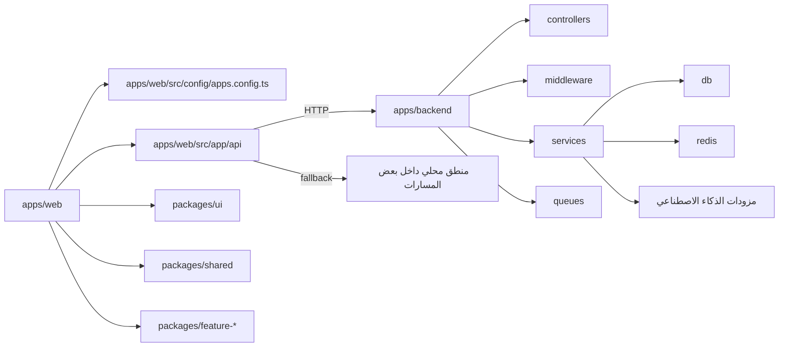

# FILE_RELATIONS

## High-Level Folder Dependencies

| Source | Target | Relation type | Verified by |
|---|---|---|---|
| `apps/web` | `packages/*` | استيراد مباشر أو تحميل كسول لحزم مساحة العمل | `apps/web/package.json`, `apps/web/next.config.ts`, صفحات الأدوات |
| `apps/web/src/app/ui/page.tsx` | `apps/web/src/config/apps.config.ts` | قراءة سجل المسارات المفعّلة | استيراد صريح |
| `apps/web/src/app/api` | `apps/backend/src/server.ts` | تمرير `HTTP` إلى الخلفية في عدة مسارات | ملفات `route.ts` الخاصة بالتحليل، النقد، والدردشة |
| `apps/web/src/app/api/breakdown/analyze/route.ts` | `apps/web/src/app/(main)/breakdown/services/geminiService` | استدعاء محلي بديل عند غياب الخلفية | استيراد ديناميكي |
| `apps/backend/src/server.ts` | `apps/backend/src/controllers/*` | تركيب مسارات `HTTP` | استيرادات صريحة |
| `apps/backend/src/server.ts` | `apps/backend/src/middleware/*` | طبقة الأمان والمراقبة ووسائط التشغيل | استيرادات صريحة |
| `apps/backend/src/server.ts` | `apps/backend/src/services/*` | منطق العمل والوقت الحقيقي | استيرادات صريحة |
| `apps/backend/src/server.ts` | `apps/backend/src/queues/*` | تهيئة العمال والطوابير | استيرادات صريحة |
| `packages/ui` | `apps/web` | عناصر واجهة مشتركة | `packages/ui/src/index.ts` واستهلاك مكونات الواجهة |
| `packages/shared` | حزم ومسارات متعددة | أنواع وأدوات مشتركة من الجذر ومسارات فرعية | `packages/shared/package.json` |

## Dependency Map



## Critical Internal Maps

### 1. قشرة الويب ومسجل الأدوات

- Why this area matters:
  - هي النقطة التي تحدد ما يظهر للمستخدم وما إذا كان المسار متاحًا أصلًا.
- Main files:
  - `apps/web/src/app/page.tsx`
  - `apps/web/src/app/ui/page.tsx`
  - `apps/web/src/components/HeroAnimation.tsx`
  - `apps/web/src/components/AppGrid.tsx`
  - `apps/web/src/config/apps.config.ts`
- Main inward dependencies:
  - الخطوط العامة، مكونات الواجهة، الصور، وروابط `Next.js`.
- Main outward dependencies:
  - صفحات الأدوات تحت `apps/web/src/app/(main)`
  - الحزم التي تُحمّلها تلك الصفحات
- Coupling note:
  - أي خطأ في `apps.config.ts` ينعكس على `/ui` و `/apps-overview` وربما على التنقل العام.

### 2. تكامل صفحات الأدوات مع حزم مساحة العمل

- Why this area matters:
  - يوضح لماذا الويب ليس المصدر الوحيد للمنطق، بل طبقة تجميع للحزم.
- Main files:
  - `apps/web/src/app/(main)/directors-studio/page.tsx`
  - `apps/web/src/app/(main)/BUDGET/page.tsx`
  - `apps/web/src/app/(main)/actorai-arabic/page.tsx`
  - `apps/web/src/app/(main)/cinematography-studio/page.tsx`
- Main inward dependencies:
  - سجل التطبيقات، مخزن المشروع المحلي، وخطافات الجلب.
- Main outward dependencies:
  - `@the-copy/directors-studio`
  - `@the-copy/budget`
  - `@the-copy/actorai`
  - `@the-copy/cinematography`
- Coupling note:
  - تغيّر عقود التصدير داخل الحزم يكسر صفحات الويب مباشرة لأن الاستهلاك غالبًا مباشر من `index.ts`.

### 3. جذر الخلفية وتركيب المسارات

- Why this area matters:
  - `server.ts` هو نقطة الربط المركزية بين الأمن، الوقت الحقيقي، الطوابير، ووحدات التحكم.
- Main files:
  - `apps/backend/src/server.ts`
  - `apps/backend/src/controllers/*`
  - `apps/backend/src/middleware/*`
  - `apps/backend/src/services/*`
  - `apps/backend/src/queues/*`
- Main inward dependencies:
  - البيئة، التتبع، التسجيل، وقاعدة البيانات.
- Main outward dependencies:
  - قاعدة البيانات
  - `Redis`
  - مزودات الذكاء الاصطناعي
  - نقاط البث الزمني
- Coupling note:
  - زيادة عدد المسارات داخل `server.ts` تجعل الملف نقطة اختناق رئيسية.

### 4. طبقة واجهات الويب البرمجية

- Why this area matters:
  - هي الجسر بين واجهة المستخدم والخلفية أو الخدمات المحلية.
- Main files:
  - `apps/web/src/app/api/analysis/seven-stations/route.ts`
  - `apps/web/src/app/api/ai/chat/route.ts`
  - `apps/web/src/app/api/breakdown/analyze/route.ts`
  - `apps/web/src/app/api/critique/*`
  - `apps/web/src/app/api/editor/route.ts`
- Main inward dependencies:
  - نماذج الطلبات من صفحات الويب.
- Main outward dependencies:
  - الخلفية عبر `HTTP`
  - خدمات محلية ضمن الأدوات
  - مزودات `Gemini` وبعض عملاء الذكاء الاصطناعي
- Coupling note:
  - الطبقة هجينة؛ لذلك يجب معرفة من ينفذ المنطق الحقيقي قبل تعديل أي مسار.

### 5. مشروع المحرر الفرعي المضمن

- Why this area matters:
  - يملك دورة حياة أدوات مستقلة نسبيًا داخل مسار واحد من الويب.
- Main files:
  - `apps/web/src/app/(main)/editor/page.tsx`
  - `apps/web/src/app/(main)/editor/package.json`
  - `apps/web/src/app/(main)/editor/src/App`
  - `apps/web/src/app/(main)/editor/server/file-import-server.mjs`
- Main inward dependencies:
  - تحميل ديناميكي من صفحة المسار.
- Main outward dependencies:
  - خادوم استيراد ملفات محلي
  - إعدادات واختبارات وأدوات مستقلة
- Coupling note:
  - يرفع عبء الصيانة لأنه يجمع تطبيقًا فرعيًا كاملًا داخل مسار من تطبيق أكبر.

## Critical Flows

1. فتح المنصة ثم اختيار أداة:
   - `apps/web/src/app/page.tsx` -> `apps/web/src/app/ui/page.tsx` -> `apps/web/src/config/apps.config.ts` -> صفحة الأداة

2. تحميل أداة من حزمة مساحة عمل:
   - صفحة أداة في الويب -> استيراد أو تحميل كسول من `@the-copy/...` -> مكوّنات الحزمة

3. تحليل المحطات السبع:
   - واجهة الويب -> `apps/web/src/app/api/analysis/seven-stations/route.ts` -> `apps/backend/src/server.ts` -> `AnalysisController` -> `AnalysisService` أو الطابور

4. تفكيك السيناريو الهجين:
   - واجهة التفكيك -> `apps/web/src/app/api/breakdown/analyze/route.ts` -> الخلفية أو `geminiService` المحلي -> النتيجة

5. إدارة مشروع في استوديو المخرج:
   - `apps/web/src/app/(main)/directors-studio/page.tsx` -> `useProjectScenes` و `useProjectCharacters` -> الخلفية -> عناصر `@the-copy/directors-studio`

## Risks

- `apps/web/src/config/apps.config.ts` يمثل نقطة تكدس للهوية والمسارات والتفعيل.
- `apps/backend/src/server.ts` يركز كثيرًا من التركيب في ملف واحد ويحتاج مراقبة مستمرة.
- `packages/ui/src/index.ts` عبارة عن شريط تصدير واسع قد يخفي ملكية المكونات.
- وجود وثائق فرعية كثيرة داخل بعض المسارات قد يخلق تعارضًا مع الوثائق الجذرية.
- المحرر المضمن تحت `apps/web/src/app/(main)/editor` يكرر إعدادات وأدوات موجودة جزئيًا في الجذر.

## Circular Dependencies

- لم يتم إثبات تبعيات دائرية صريحة من القراءة الحالية.
- لم تُجر مراجعة آلية شاملة لكل مسار استيراد، لذلك هذه ملاحظة حدود وليست حكمًا نهائيًا.

## Barrels And Ownership

- تستخدم الحزم النمط التالي بكثرة:

```text
packages/*/src/index.ts
```

وهو جيد كواجهة عامة، لكنه يخفي مكان الرمز الفعلي عند القراءة السريعة.

- `packages/ui/src/index.ts` يجمع عناصر أولية ومجالية في ملف واحد، ما يجعل التوثيق الجذري مهمًا لتوضيح الغرض من الحزمة دون تتبع كل ملف يدويًا.
