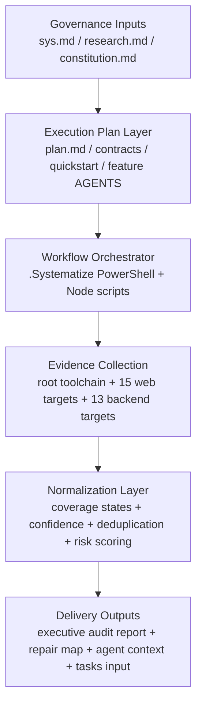

# Implementation Plan: Platform Multi-Layer Audit

## Plan Card

| Field | Value |
|-------|-------|
| **Branch** | `002-audit-platform-apps` |
| **Date** | 2026-03-18 |
| **Sys** | `E:\yarab we elnby\the copy\features\002-audit-platform-apps\sys.md` |
| **Plan Version** | 1.0 |
| **Status** | ☐ Draft ☑ Under Review ☐ Approved |
| **Readiness** | ☐ Not Ready ☐ Preliminary ☑ Ready for Execution |
| **Product Manager** | Mohamed Aimen Raed |
| **Technical Lead** | Mohamed Aimen Raed |
| **Target Launch** | 2026-04-07 |
| **Project Profile** | ☐ S (Small) ☑ M (Medium) ☐ L (Large) |

**Profile Rationale:** تم اختيار
`M`
لأن الميزة عابرة لطبقات متعددة داخل المستودع نفسه، وتحتاج تعديلات على الوثائق
والسكربتات والعقود، لكنها لا تتطلب خدمة مستقلة أو فريقًا كبيرًا متعدد
المنتجات.

---

## 1. Summary *(mandatory)*

هذه الخطة تنفذ ما عرّفه
`sys.md`
في الأقسام
`1.5`
و
`3.1`
و
`5.1`
وتطبق نتيجة
`research.md`
التي انتهت إلى
`PROCEED WITH CHANGES`.
المطلوب هنا ليس بناء تطبيق جديد، بل تثبيت مسار تنفيذ حاكم للمراجعة متعددة
الطبقات داخل المستودع نفسه، بحيث يصبح قابلاً للتنفيذ والتكرار والتسليم دون
ثقة زائفة أو اتساع غير منضبط في النطاق.

الاتجاه التقني المعتمد هو:

1. شد بوابات سير العمل داخل
   `.Systematize`
   حتى لا تتعارض المراحل مع بعضها.
2. تحويل النطاق المحدد في
   `sys.md`
   إلى سجل تغطية صريح لخمسة عشر هدف واجهة وثلاثة عشر هدف خلفية.
3. فصل الأدلة الآلية عن الحكم النهائي، مع إبقاء
   `runtime validation`
   وفروق
   `dev / production`
   ومحور الثقة كطبقات مستقلة لا تُختزل في نجاح أداة واحدة.

---

## 2. Technical Context *(mandatory)*

| Field | Value |
|-------|-------|
| **Language/Version** | PowerShell 7.x للأتمتة، Node.js 20.x لبيئة التشغيل، TypeScript 5.9.x للكود الجاري تدقيقه والسكربتات المساندة |
| **Primary Dependencies** | pnpm 10.32.1, Turborepo 2.5.0, Next.js 16.1.5, React 19.2.1, Express 5.1.0, Vitest 4.x, Playwright 1.49.x, Zod 4.x, OpenTelemetry 2.2.x, Sentry 10.32.1 |
| **Storage** | N/A — لا توجد قاعدة بيانات جديدة؛ التنفيذ يقرأ ملفات المستودع ومخرجات الأوامر ويكتب وثائق Markdown وعقودًا نصية |
| **Testing Framework** | Vitest 4.x, Playwright 1.49.x, ESLint 9.x, TypeScript compiler, واختبارات تدفق سكربتات PowerShell وNode |
| **Target Platform** | سير عمل داخلي على Windows-first monorepo يعمل فوق Node.js 20.x و pnpm 10.x مع Git feature branch |
| **Project Type** | internal governance workflow for a web-fullstack monorepo audit |
| **Performance Goals** | أوامر الإعداد وتحديث السياق يجب أن تكتمل في ≤ 30 ثانية على workspace دافئ؛ تشغيل التدقيق المستقبلي يجب أن يحصي 28 هدفًا و4 فحوصات آلية في تمريرة واحدة بلا أهداف orphaned |
| **Constraints** | لا تنفيذ قبل الاعتماد؛ لا أسرار داخل المخرجات؛ لا خدمة مستقلة جديدة؛ لا تقديرات زمنية داخل تقرير الإصلاح النهائي؛ النطاق يبقى path-scoped حتى يصدر تغيير رسمي |
| **Scale/Scope** | 15 أهداف واجهة + 13 أهداف خلفية + جذر المستودع + سكربتات Systematize + عقود الوثائق المصاحبة |

### 2.1 Machine-Readable Summary

**Language/Version**: PowerShell 7.x, Node.js 20.x, TypeScript 5.9.x

**Primary Dependencies**: pnpm 10.32.1, Turborepo 2.5.0, Next.js 16.1.5, React 19.2.1, Express 5.1.0, Vitest 4.x, Playwright 1.49.x, Zod 4.x

**Storage**: N/A

**Testing Framework**: Vitest 4.x, Playwright 1.49.x, ESLint 9.x, TypeScript compiler

**Target Platform**: Windows-first monorepo workflow on Node.js 20.x and pnpm 10.x

**Project Type**: internal governance workflow for a web-fullstack monorepo audit

**Performance Goals**: setup and context update <= 30s on warm workspace; future audit run classifies 28 targets and 4 checks in one pass

**Constraints**: no secrets in artifacts; no implementation before approval; no standalone service; no time estimates in repair output; scope remains path-scoped

**Scale/Scope**: 15 web targets, 13 backend targets, repo root toolchain, feature docs, contracts, and workflow scripts

### 2.2 Evidence Basis

- تقنيات المستودع الأساسية مأخوذة من
  `E:\yarab we elnby\the copy\package.json`
  و
  `E:\yarab we elnby\the copy\apps\web\package.json`
  و
  `E:\yarab we elnby\the copy\apps\backend\package.json`
  و
  `E:\yarab we elnby\the copy\turbo.json`.
- شروط القابلية والتنفيذ والقيود مأخوذة من
  `E:\yarab we elnby\the copy\features\002-audit-platform-apps\research.md`
  خصوصًا
  `11.3`
  و
  `11.6`
  و
  `12`.

---

## 3. Stakeholders & Decision Rights *(mandatory)*

| Decision Type | Decision Maker | Consulted | Informed |
|---------------|---------------|-----------|----------|
| Product decisions | Mohamed Aimen Raed | قيادة المنصة، المسؤول التقني | فرق الواجهة والخلفية، مسؤول الجودة والإطلاق |
| Technical decisions | Mohamed Aimen Raed | فرق الواجهة والخلفية، مسؤول الجودة والإطلاق | قيادة المنصة |
| Budget decisions | قيادة المنصة | Mohamed Aimen Raed | الفرق المتأثرة |
| Launch decisions | مسؤول الجودة والإطلاق | Mohamed Aimen Raed، قيادة المنصة | جميع المنفذين على الميزة |

**Execution Rule:** أي تغيير يمس النطاق أو البوابة أو عقود المخرجات يحتاج موافقة
صريحة من صاحب القرار المنتج والتقني معًا قبل اعتماده داخل هذه الخطة.

---

## 4. Architecture *(mandatory)*

### 4.1 Component Overview



**Architecture Intent:** لا توجد خدمة تشغيلية جديدة. التنفيذ يبقى repo-native،
ويحوّل وثائق الحوكمة والسكربتات الحالية إلى خط تنفيذ يمكن الوثوق به.

### 4.2 Architectural Decisions

| Decision | Context | Rejected Alternatives | Rationale |
|----------|---------|----------------------|-----------|
| الإبقاء على التنفيذ داخل `.Systematize` وfeature workspace بدل إنشاء أداة مستقلة | الميزة تحكم سير عمل داخل المستودع لا منتجًا منفصلًا | لوحة ويب مستقلة؛ خدمة تدقيق خارجية؛ checklist يدوي | أقل كلفة تكامل وصيانة، ويحافظ على versioned evidence داخل Git، ويتماشى مع الدستور القائم |
| اعتماد سجل تغطية path-scoped مأخوذ من `sys.md` كمصدر الحقيقة | البحث أثبت أن أخطر المخاطر هي scope drift والتغطية الزائفة | اكتشاف تلقائي كامل للمستودع؛ نص حر في كل تشغيل | يمنع الاتساع الضمني، ويجبر كل هدف على حالة واضحة، ويسهل التتبع |
| اعتبار `lint` و`type-check` و`test` و`build` Evidence inputs لا Ready/Not Ready verdicts | البحث أثبت أن الأدوات وحدها لا تكفي، وأن `apps/web` الحالية ذات تغطية جزئية | tool-only gate؛ review وصفي يدوي بلا تشغيل | يجمع قابلية الإعادة مع التحليل البشري المنظم، ويمنع الثقة الزائفة |
| إبقاء `runtime validation` والأمن طبقة مستقلة | `TypeScript` يمحو الأنواع بعد الترجمة ووجود المكتبات لا يثبت التفعيل | استنتاج الحماية من TypeScript أو من قائمة dependencies فقط | يتفق مع بحث الميزة ومع توجيهات OWASP والدستور |

### 4.3 Rejected Structural Alternative Summary

- **Standalone dashboard**:
  رُفض لأنه يضيف مصادقة وتخزينًا وتشغيلًا غير مطلوبين قبل تثبيت أصل المشكلة.
- **Repo-wide auto-discovery as scope source**:
  رُفض لأنه يحوّل التدقيق إلى مسح مفتوح قد يكسر التزامات النطاق الحالية.
- **One-tool quality gate**:
  رُفض لأن البحث أثبت أن الأدوات لا تحل محل التطبيع والتفسير والتنفيذ المرحلي.

---

## 5. Security & Privacy *(mandatory)*

| Domain | Requirement | Implementation |
|--------|-------------|---------------|
| **Authentication** | لا توجد طبقة مصادقة نهائية جديدة للمستخدمين | التنفيذ يعتمد على هوية مطور/مراجع يملك وصولاً محليًا إلى المستودع وحقوق Git الحالية فقط |
| **Authorization** | لا يجوز لأي مساهم تعديل بوابات التدقيق أو اعتماد الخطة دون صلاحية مناسبة | التعديلات على `.Systematize` وملفات الميزة والعقود تخضع لحقوق الكتابة في المستودع، والاعتماد النهائي يتبع جدول القرار في القسم 3 |
| **Encryption** | لا يجوز تخزين أسرار أو متغيرات بيئية مكشوفة داخل المخرجات | لا توجد قاعدة بيانات جديدة؛ النقل عبر Git/TLS عند الدفع؛ أي output خام قد يحتوي أسرارًا يجب تلخيصه أو تنقيحه قبل الكتابة |
| **Audit Logging** | يجب أن يبقى أثر التغيير والتنفيذ قابلاً للتتبع | سجل التغييرات في الخطة، تاريخ Git، مخرجات حالة الأوامر الملخّصة، وتحديثات الوثائق feature-level هي سجل التدقيق الرسمي |

**Privacy Note:** لا تجمع هذه الميزة بيانات مستخدمين تشغيلية بحد ذاتها. إذا ظهر
محتوى حساس أثناء التنفيذ، فالتصرف المسموح هو التنقيح أو الاستبعاد، لا النسخ
الحرفي.

---

## 6. Data Model & Controls *(conditional — include if feature involves data)*

### 6.1 Entities

| Entity | Description | Key Fields | Sensitivity |
|--------|-------------|------------|-------------|
| AuditTarget | هدف تدقيق واحد ضمن النطاق الرسمي | `path`, `targetType`, `expectedLayers`, `coverageStatus`, `blockedReason` | Low |
| AutomatedCheckResult | نتيجة فحص آلي واحدة قابلة للتفسير | `checkName`, `scope`, `status`, `directCause`, `confidenceImpact`, `evidenceRef` | Medium |
| Finding | نتيجة نهائية قابلة للتنفيذ | `findingId`, `type`, `severity`, `layer`, `location`, `problem`, `evidence`, `impact`, `fix` | Medium |
| ConfidenceStatement | بيان رسمي لقوة الحكم | `reviewMode`, `confidenceLevel`, `executedChecks`, `blockedAreas`, `residualRisk` | Low |
| RepairActionGroup | مجموعة إصلاح مرتبة بالأولوية | `groupId`, `priority`, `linkedFindings`, `requiredChanges`, `successCriteria` | Low |
| AuditReportEnvelope | الحاوية النهائية للتقرير التنفيذي | `reportId`, `targetRegisterRef`, `findingsRef`, `decision`, `topFiveRef`, `actionPlanRef` | Low |

### 6.2 Data Controls

| Control | Details |
|---------|---------|
| **Data Source** | ملفات المستودع، إعدادات البناء، ومخرجات الأوامر المحلية فقط |
| **Deletion Policy** | تبقى وثائق الميزة ما دام الفرع أو الميزة نشطين؛ أي capture حساس بالخطأ يُحذف فورًا ويُستبدل بملخص منقح |
| **Backup** | النسخة الاحتياطية الرسمية هي Git history والنسخة البعيدة للمستودع إذا تم الدفع |
| **Encryption** | في الراحة: حسب تشفير القرص أو بيئة التطوير الحالية؛ أثناء النقل: Git/TLS فقط؛ لا مفاتيح جديدة داخل هذه الميزة |
| **Redaction Rule** | يمنع إدراج قيم أسرار، أو ملفات `.env*`، أو محتوى raw logs غير منقح داخل العقود أو التقارير |

### 6.3 State Transitions

| Entity | State Flow |
|--------|-----------|
| AuditTarget | `discovered -> scoped -> inspected / blocked / out_of_scope -> reported` |
| AutomatedCheckResult | `planned -> executed / failed / blocked -> interpreted -> reported` |
| Finding | `candidate -> normalized -> merged -> prioritized -> reported` |
| RepairActionGroup | `draft -> triaged -> approved -> tracked` |

---

## 7. Phased Execution Plan *(mandatory)*

### 7.1 Phases

| Phase | Objective | Duration | Deliverables | Transition Criteria |
|-------|-----------|----------|-------------|-------------------|
| **Foundation & Gate Repair** | غلق شروط البحث الملزمة وتحويلها إلى baseline تنفيذي | 2 business days | إصلاح بوابة التحقق المسبق، تثبيت سجل الأهداف، تحديث الخطة والعقود الأساسية | `setup-plan` و`research` و`constitution` تعمل بلا تعارض، وجميع الأهداف 28 موجودة في سجل التغطية |
| **Contracts & Coverage Normalization** | تعريف العقود الرسمية للمخرجات وحالات التغطية | 3 business days | عقود التقرير والنتائج والتغطية، AGENTS feature-level، quickstart | كل هدف يحمل حالة تغطية صريحة، وكل فحص آلي يحمل حالة تنفيذ معروفة |
| **Execution Pipeline Hardening** | شد سكربتات جمع الأدلة وتطبيعها | 4 business days | تعديلات `.Systematize/scripts` و`.Systematize/templates` اللازمة، قواعد deduplication والثقة | dry run واحد يصدر Evidence register كاملًا ولا يساوي بين tool pass والجاهزية |
| **Verification & Acceptance** | إثبات أن التنفيذ لا يكسر workflow وأن العقود قابلة للتحقق | 3 business days | اختبارات unit/integration/acceptance/performance، إعادة فحص دستوري، تحديث agent context | جميع اختبارات التنفيذ تمر، والعقود لا تحتوي تناقضات، والبوابات لا تعود لكسر البحث أو الخطة |
| **Rollout & Handoff** | تجهيز تسليم التنفيذ إلى `/syskit.tasks` ثم التنفيذ | 2 business days | حزمة اعتماد نهائية، quickstart مجرب، backlog tasks قابل للتوليد | الخطة معتمدة، وقائمة المهام قابلة للاشتقاق مباشرة بلا blocker تقني |

### 7.2 Milestones

| Milestone | Target Date | Deliverable | Owner |
|-----------|------------|-------------|-------|
| Gate repair approved | 2026-03-20 | إصلاح شرط البحث السابق لأوانه وتثبيت baseline الأهداف | Mohamed Aimen Raed |
| Contracts baseline complete | 2026-03-24 | عقود التقرير والتغطية والنتائج + feature AGENTS + quickstart | Mohamed Aimen Raed |
| Evidence pipeline dry run | 2026-03-30 | dry run يفسر 4 فحوصات آلية و28 هدفًا دون orphaned scope | Mohamed Aimen Raed |
| Verification complete | 2026-04-03 | نتائج الاختبارات وقبول التنفيذ | Mohamed Aimen Raed |
| Tasks handoff ready | 2026-04-07 | خطة جاهزة للتحويل إلى `/syskit.tasks` | قيادة المنصة + Mohamed Aimen Raed |

---

## 8. Testing Strategy *(mandatory)*

### 8.1 Test Levels

| Level | Purpose | Owner | Success Criteria |
|-------|---------|-------|-----------------|
| Unit tests | التحقق من وظائف deterministic مثل target registry وcoverage mapping وrisk scoring وreadiness helpers | Technical Lead | ≥ 85% branch coverage على الوحدات الجديدة وعدم وجود regression معروف |
| Integration tests | التحقق من تكامل سكربتات PowerShell وNode وملفات feature docs والعقود | Technical Lead | مخرجات JSON ثابتة، وعدم عودة blocker `plan.md before research`، وتطابق العقود مع المخرجات |
| Acceptance tests | التحقق من أن workflow ينتج artifacts صحيحة من منظور المستخدم الداخلي | Product Manager + Technical Lead | جميع الأهداف 28 بحالة صريحة، و4 فحوصات آلية موثقة، والعناوين التنفيذية الإلزامية محفوظة |
| Performance tests | التحقق من أن latency التشغيلية للمطور لا تتضخم | Technical Lead | `setup-plan` + `update-agent-context` ≤ 30s على warm workspace، والتحقق الأولي للعقود ≤ 60s |

### 8.2 Feature Acceptance Criteria

| Feature Slice | Must Work | Must Not Break | Edge Case |
|---------------|-----------|---------------|-----------|
| Workflow gate integrity | البحث يسبق الخطة فعليًا دون blocker شكلي | لا ينكسر branch detection أو feature dir resolution | غياب `plan.md` يجب أن يمنع `tasks` لاحقًا لا `research` |
| Coverage normalization | كل هدف من الأهداف 28 يظهر مرة واحدة بحالة صريحة | لا تُضم أهداف غير مذكورة في `sys.md` تلقائيًا | مسار مفقود يسجل كقيد تغطية لا كعيب كود |
| Automated evidence contract | كل فحص من `lint / type-check / test / build` يسجل بحالة موحدة مع أثر على الثقة | لا يتحول النجاح الجزئي إلى حكم جاهزية | فشل فحص واحد لا يوقف قراءة الطبقات الأخرى |
| Executive output contract | التقرير النهائي يلتزم الترتيب والعناوين والحقول الإلزامية | لا تتكرر العلة نفسها بصيغ متعددة | وجود secrets في output خام يجب أن يؤدي إلى redaction قبل الكتابة |

### 8.3 Traceability Note

معايير المتطلبات الأصلية تبقى في
`E:\yarab we elnby\the copy\features\002-audit-platform-apps\sys.md`
داخل القسم
`5.1`.
هذه الاستراتيجية تضيف طبقة تنفيذ واختبار على مستوى البناء والدمج والتسليم.

---

## 9. Risk Registry *(mandatory)*

| Risk ID | Domain | Risk | Probability | Impact | Score | Mitigation | Owner |
|---------|--------|------|-------------|--------|-------|-----------|-------|
| PL-RK-01 | Scope | اتساع النطاق خارج الأهداف 28 بسبب اكتشاف تلقائي غير مضبوط أو إضافات لاحقة غير موثقة | Medium | High | 6 | اعتماد `sys.md` كسجل حقيقة، وإنشاء contract مستقل للتغطية، ومنع أي هدف بلا موافقة تغيير | Product Manager |
| PL-RK-02 | Technical | بقاء تعارض بوابة البحث والخطة أو بقاء تغطية `apps/web` الجزئية دون تطبيع | High | High | 9 | تنفيذ Foundation & Gate Repair أولًا، وإضافة integration test يمنع regression نفسه | Technical Lead |
| PL-RK-03 | Resource | تمركز المنتج والقرار التقني في شخص واحد قد يؤخر المراجعة والاعتماد | Medium | Medium | 4 | جدولة نقاط اعتماد محددة لكل milestone وتجميد scope changes بين المراحل | Product Manager |
| PL-RK-04 | Integration | اختلاف مخرجات سكربتات PowerShell وNode أو اختلاف العقود النصية عن JSON المولد | Medium | High | 6 | توحيد الحقول الأساسية داخل contracts، وإنشاء tests تقارن المخرجات الفعلية بالعقد | Technical Lead |
| PL-RK-05 | Security | تسرب أسرار أو قيم بيئية أو مسارات حساسة بشكل raw داخل artifacts | Medium | High | 6 | تطبيق redaction rule قبل الكتابة، وإضافة acceptance test سلبي على الأسرار | Technical Lead |
| PL-RK-06 | Budget | تحول التنفيذ إلى أداة أو dashboard مستقل سيرفع كلفة الصيانة بلا قيمة لازمة الآن | Low | Medium | 2 | تثبيت قرار repo-native architecture ورفض أي توسع إلى خدمة مستقلة ما لم يتغير الدستور | قيادة المنصة |

### Risk Domains Checklist

- [x] Scope risks checked
- [x] Technical risks checked
- [x] Resource risks checked
- [x] Integration risks checked
- [x] Security risks checked
- [x] Budget risks checked

---

## 10. Success Indicators *(mandatory)*

### 10.1 Pre-Launch Indicators

| Indicator | What It Proves | Target | Timing |
|-----------|---------------|--------|--------|
| Plan completeness | أن التنفيذ يملك مرجعًا حاكمًا مكتملاً | 100% sections filled | Before approval |
| Constitution gate pass rate | أن الخطة لا تنتهك الدستور | 100% pass | Before `/syskit.tasks` |
| Pre-approval checklist | أن التنفيذ قابل للبدء دون gaps هيكلية | 11 / 11 | Before approval |
| Contract validation pass rate | أن العقود قابلة للتطبيق على المخرجات | 100% | Before implementation starts |
| Dry-run artifact completeness | أن المخرجات الأساسية قابلة للتوليد | 28 / 28 targets + 4 / 4 checks accounted | Before `/syskit.tasks` |

### 10.2 Post-Launch Indicators

| Indicator | What It Proves | Target | Timing |
|-----------|---------------|--------|--------|
| Audit adoption rate | أن الفرق تستخدم workflow الجديد بدل المسارات المتفرقة | 100% من جولات تدقيق المنصة الجديدة | خلال أول 30 يومًا |
| Coverage fidelity | أن النطاق لا يفقد أهدافًا أو يضيف أهدافًا ضمنيًا | 0 أهداف orphaned في أول 6 جولات | أول 6 جولات |
| False-confidence incidents | أن القرارات لم تعد تُبنى على tool pass فقط | 0 incidents | أول 6 جولات |
| Operator turnaround | أن workflow عملي لا نظري | إصدار أول تقرير منظم خلال ≤ 1 business day من بدء الجولة | بعد الإطلاق |
| Workflow maintenance load | أن الميزة قابلة للصيانة | ≤ 1 hotfix workflow لكل 5 جولات | بعد أول 5 جولات |

---

## 11. Constitution Check

| Gate | Source | Status | Evidence |
|------|--------|--------|----------|
| لا تنفيذ قبل خطة معتمدة | الدستور §3 قاعدة 1 و§4 | Pass | الخطة مكتملة لكن حالتها `Under Review`، والاعتماد مفصول في القسم 17 |
| لا توسع غير منضبط في النطاق | الدستور §7.5 و§21.2 | Pass | الخطة تقيد التنفيذ بالأهداف 28 وبعقد تغطية مستقل |
| كل تغيير مهم يجب أن يمر عبر تغيير موثق | الدستور §3 قاعدة 6 و§25 | Pass | القسم 14 يعرّف عملية تغيير وسجلًا ابتدائيًا |
| runtime validation لا يُسقط لصالح TypeScript | الدستور §18 وADR-003 | Pass | الأقسام 4 و5 و8 تحفظ هذا المحور كطبقة مستقلة |
| لا كشف لأسرار أو بيانات حساسة | الدستور §18 و§21.2 | Pass | القسم 5 وقسم العقود يفرضان redaction rule صريحة |
| التتبع والاختبار والقبول يجب أن تبقى قابلة للمراجعة | الدستور §20 و§26 و§27 | Pass | الخطة تربط التنفيذ باختبارات مستوى الوحدة والتكامل والقبول والأداء، وتستند إلى sys/research بعناوين واضحة |

**Constitution Result:** Pass

---

## 12. Project Structure *(mandatory)*

### 12.1 Documentation (this feature)

```text
E:\yarab we elnby\the copy\features\002-audit-platform-apps\
├── sys.md
├── research.md
├── plan.md
├── AGENTS.md
├── quickstart.md
├── contracts\
│   ├── audit-report-contract.md
│   ├── coverage-registry-contract.md
│   ├── check-execution-contract.md
│   └── finding-record-contract.md
└── checklists\
```

### 12.2 Source Code (repository root)

```text
E:\yarab we elnby\the copy\
├── .Systematize\
│   ├── scripts\
│   │   ├── powershell\
│   │   └── node\
│   ├── templates\
│   └── memory\
├── apps\
│   ├── web\
│   └── backend\
├── packages\
└── features\
    └── 002-audit-platform-apps\
```

**Structure Decision:** التنفيذ سيعدل artifacts الحاكمة داخل
`.Systematize`
ويحفظ مخرجات الميزة داخل feature workspace نفسه. لم يتم اختيار خدمة أو مشروع
فرعي جديد لأن الميزة تخص workflow داخليًا لا runtime application مستقلًا.

---

## 13. Complexity Tracking

لا توجد مخالفات دستورية تحتاج إلى تبرير في هذه النسخة. إذا استلزم التنفيذ لاحقًا
إضافة تخزين جديد، أو خدمة مستقلة، أو طبقة تشغيل إضافية، يجب فتح هذا القسم
صراحة قبل اعتماد التغيير.

---

## 14. Change Management *(mandatory)*

### 14.1 Change Request Process

كل تغيير على هذه الخطة يجب أن يجيب صراحة عن:

1. ما الذي تغيّر؟
2. لماذا تغيّر؟
3. ما أثره على النطاق، والمدة، وكلفة الصيانة؟
4. من وافق عليه؟

**Approval Thresholds:**

- تغييرات النطاق أو العقود أو البوابات:
  Product Manager + Technical Lead
- تغييرات الأمن أو redaction أو حكم الثقة:
  Technical Lead + Launch Decision Maker
- تحسينات الصياغة غير المؤثرة على المعنى:
  Technical Lead

### 14.2 Change Log

| Version | Date | Change | Reason | Approved By |
|---------|------|--------|--------|-------------|
| 1.0 | 2026-03-18 | إنشاء أول نسخة من خطة التنفيذ وإضافة مخرجات Phase 1 design & contracts | تحويل ناتج البحث إلى مرجع تنفيذ حاكم | Pending approval |

---

## 15. Readiness Gate *(mandatory)*

| Gate | Status | Blocking Items |
|------|--------|---------------|
| **Not Ready** | ☐ | None |
| **Preliminary** | ☐ | None |
| **Ready for Execution** | ☑ | لا توجد blockers تخطيطية مفتوحة؛ التنفيذ يبدأ بعد الاعتماد الرسمي فقط |

### Reasons for Non-Readiness (if applicable)

N/A

---

## 16. Plan Quality Checklist

### 16.1 Pre-Approval Checklist *(mandatory)*

- [x] Problem is clearly defined (in sys)
- [x] Expected value is known and measurable (in sys)
- [x] Scope (in/out) is documented (in sys)
- [x] Stakeholders and decision rights are documented
- [x] Functional requirements are written and testable (in sys)
- [x] Non-functional requirements are approved (in sys)
- [x] Business rules are explicitly written (in sys)
- [x] Integrations and failure plans are documented
- [x] Risks are identified with mitigation plans
- [x] Acceptance criteria are defined
- [x] Phased execution plan is ready

### 16.2 Pre-Launch Checklist *(fill before launch)*

- [ ] All tests pass
- [ ] Performance is within approved limits
- [ ] Documentation is complete
- [ ] Support team is ready
- [ ] Rollback plan is ready
- [ ] Monitoring and alerts are active

---

## 17. Approval

| Role | Name | Signature | Date |
|------|------|-----------|------|
| Product Manager | Mohamed Aimen Raed | Pending | Pending |
| Technical Lead | Mohamed Aimen Raed | Pending | Pending |
| Project Sponsor | قيادة المنصة | Pending | Pending |

---

## Appendices *(optional)*

### Appendix A: References

- `E:\yarab we elnby\the copy\features\002-audit-platform-apps\sys.md`
- `E:\yarab we elnby\the copy\features\002-audit-platform-apps\research.md`
- `E:\yarab we elnby\the copy\.Systematize\memory\constitution.md`
- `https://www.typescriptlang.org/docs/handbook/typescript-from-scratch`
- `https://cheatsheetseries.owasp.org/cheatsheets/Input_Validation_Cheat_Sheet.html`
- `https://dora.dev/guides/dora-metrics/history/`
- `https://www.microsoft.com/en-us/research/wp-content/uploads/2016/02/ICSE202013-codereview.pdf`

---

## Changelog

| التاريخ | الإصدار | التغيير | المؤلف |
|---------|---------|--------|--------|
| 2026-03-18 | 1.0 | إنشاء خطة التنفيذ الكاملة وإغلاق مخرجات Phase 1 design & contracts على مستوى التخطيط | Codex |

